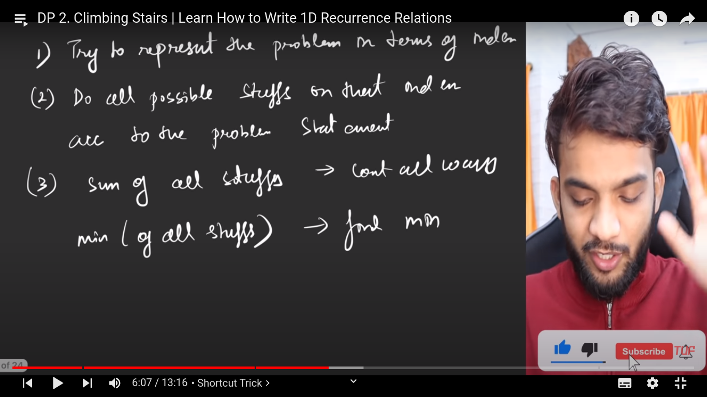

#### DP:

**DP** - those who can't remember the past are condemend to repeat it.
Two ways -
i. Tabulation
ii. Memoization

**When to use DP**:

- problems like try all possible way (count, min/max)

**Tricks**:

- Remember these three stuff for all dp problems
  
